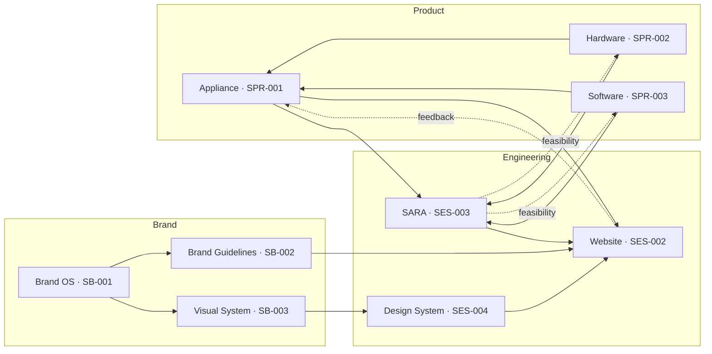

# SPK-KG-001 — Spark AI Knowledge Graph

**Status:** Active  
**Owner:** Spark AI Foundation System  
**Scope:** Brand, Engineering and Product knowledge relationships

## Graph overview

```text
Spark AI Knowledge Graph
│
├── Brand
│   ├── Brand OS
│   ├── Brand Guidelines
│   └── Visual System
│
├── Engineering
│   ├── Website
│   ├── SARA
│   └── Design System
│
└── Product
    ├── Appliance
    ├── Hardware
    └── Software
```

## Registered nodes

### Brand

| Node | Source document | Responsibility |
| --- | --- | --- |
| Brand OS | [SB-001](../brand/SB-001.md) | Brand architecture, narrative logic and governance model |
| Brand Guidelines | [SB-002](../brand/SB-002.md) | Naming, terminology, voice and public-expression rules |
| Visual System | [SB-003](../brand/SB-003.md) | Visual language, layout, illustration and motion principles |

### Engineering

| Node | Source document | Responsibility |
| --- | --- | --- |
| Website | [SES-002](../engineering/SES-002.md) | Website architecture, routes, content delivery and verification |
| SARA | [SES-003](../engineering/SES-003.md) | Spark AI Reference Architecture and system boundaries |
| Design System | [SES-004](../engineering/SES-004.md) | Reusable implementation components, tokens and accessibility |

Website brand migration is governed by [SES-001](../engineering/SES-001.md) as a transformation program connecting Brand, Product and Website nodes.

### Product

| Node | Source document | Responsibility |
| --- | --- | --- |
| Appliance | [SPR-001](../product/SPR-001.md) | Spark Appliance™ product definition, customers and requirements |
| Hardware | [SPR-002](../product/SPR-002.md) | Approved hardware configurations and evidence-backed limits |
| Software | [SPR-003](../product/SPR-003.md) | Software services, interfaces, governance and operational boundaries |

Product sequencing and milestones are governed by [SPR-004](../product/SPR-004.md).

## Relationship model



## Edge semantics

### Defines

A source node establishes identity, scope or requirements for a downstream node.

Example: Appliance defines the product truth that Website must communicate.

### Implements

An Engineering node translates Product or Brand decisions into operational systems.

Example: Design System implements the Visual System.

### Governs

A Brand or Product source constrains how a downstream node may represent a decision.

Example: Brand Guidelines govern product naming in Website.

### Verifies

An Engineering node confirms whether a Product claim is technically supportable.

Example: SARA verifies the system boundary implied by Appliance, Hardware and Software.

### Expresses

A customer-facing node presents approved upstream knowledge.

Example: Website expresses Appliance through Brand Guidelines and Visual System.

### Feedback

Evidence from implementation, customers or conversion may trigger upstream review. Feedback does not silently change the source document.

## Source-of-truth rules

1. **Appliance** owns the product definition.
2. **Hardware** owns physical configuration and hardware claims.
3. **Software** owns software services and software capability boundaries.
4. **SARA** owns the integrated reference architecture.
5. **Brand OS** owns the brand hierarchy and narrative logic.
6. **Brand Guidelines** own naming and language rules.
7. **Visual System** owns visual principles.
8. **Design System** owns reusable frontend implementation.
9. **Website** owns page composition and public delivery, not upstream product truth.

## Change propagation

### Product change

```text
Appliance / Hardware / Software
→ SARA review
→ Brand claims review
→ Website and download update
→ Verification
```

### Brand change

```text
Brand OS
→ Brand Guidelines and Visual System
→ Design System
→ Website
→ Consistency review
```

### Engineering discovery

```text
SARA / Website / Design System evidence
→ Product feasibility review
→ Source Product document revision
→ Brand and Website propagation
```

## Knowledge graph acceptance test

- Every customer-facing product claim resolves to Appliance, Hardware or Software.
- Every architecture diagram resolves to SARA.
- Every public name resolves to Brand Guidelines.
- Every visual pattern resolves to Visual System or Design System.
- Website does not become the sole source of product truth.
- Changes propagate through recorded decisions rather than isolated text edits.

## Related documents

- [Foundation System](./SPK-FS-001.md)
- [Document Classification](./SPK-FS-002.md)
- [Decision Process](./SPK-FS-003.md)
- [Foundation Registry](./SPK-FS-002.md)
