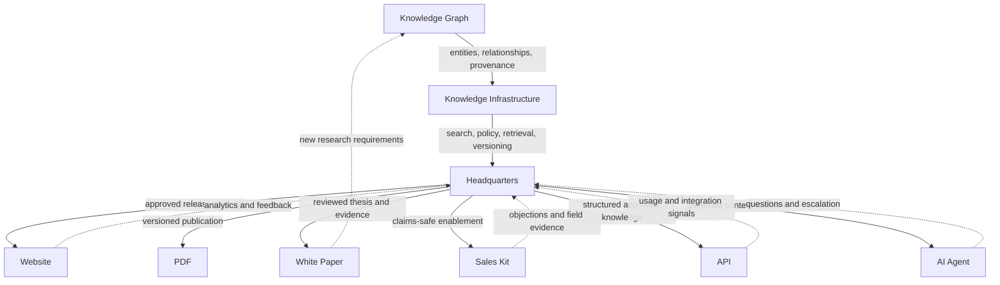

# SPK-KG-002 — Knowledge Infrastructure Delivery Graph

**Status:** Active  
**Owner:** Spark AI Foundation System  
**Purpose:** Define how governed knowledge becomes consistent customer, partner and machine-facing outputs

## Delivery chain

```text
Knowledge Graph
      ↓
Knowledge Infrastructure
      ↓
Headquarters
      ↓
Website · PDF · White Paper · Sales Kit · API · AI Agent
```

## System intent

Spark AI should maintain one governed knowledge system and many delivery surfaces.

The Website, PDFs, White Papers, Sales Kits, APIs and AI Agents must not become independent sources of product truth. They are projections of approved knowledge held and governed upstream.

## Layer 1 — Knowledge Graph

### Responsibility

The Knowledge Graph records entities, definitions, relationships, ownership, evidence and dependencies across Brand, Engineering, Product, Research and Corporate knowledge.

### Core entities

- Company
- Brand
- Platform
- Product
- Hardware
- Software
- Architecture
- Capability
- Customer
- Industry
- Use case
- Claim
- Evidence
- Document
- Decision
- Owner

### Core relationships

- defines
- implements
- governs
- verifies
- depends on
- supports
- supersedes
- expressed by
- approved by

### Output

A traceable semantic model answering:

- What is this concept?
- Who owns it?
- Which evidence supports it?
- Which products and documents depend on it?
- Which version is current?

## Layer 2 — Knowledge Infrastructure

### Responsibility

Knowledge Infrastructure makes the graph usable, governable and distributable.

### Required services

- Document ingestion
- Metadata and entity extraction
- Version control
- Search and retrieval
- Enterprise RAG
- Access policy
- Claims and evidence linking
- Approval state
- Change propagation
- API access
- AI Agent context and tool boundaries
- Audit and observability
- Long-term retention

### Governance requirement

Infrastructure must preserve the distinction between:

- approved fact;
- technical specification;
- research finding;
- assumption;
- roadmap item;
- prohibited or superseded claim.

## Layer 3 — Headquarters

### Definition

**Headquarters** is the authoritative knowledge operations and publishing control layer for Spark AI.

It is not merely a document folder or CMS. It coordinates source ownership, review, approval, release and downstream synchronization.

### Headquarters responsibilities

- Maintain the canonical document registry
- Resolve source-of-truth conflicts
- Route decisions through the Foundation process
- Approve product and brand releases
- Manage claims and evidence status
- Publish approved content packages
- Notify downstream owners of changes
- Track channel consistency
- Preserve superseded versions and decision history

### Headquarters roles

| Role | Responsibility |
| --- | --- |
| Product owner | Product truth and roadmap |
| Engineering owner | Technical implementation and verification |
| Brand owner | Naming, narrative and visual expression |
| Research owner | Evidence and research quality |
| Corporate owner | Policy, legal, investor and material risk |
| Release owner | Channel synchronization and proof of publication |

## Delivery surfaces

### Website

Purpose: discoverable, interactive product and company experience.

Consumes:

- approved product definitions;
- brand language;
- architecture diagrams;
- current claims;
- metadata and SEO packages;
- conversion actions.

Must return analytics and customer feedback to Headquarters without changing upstream truth directly.

### PDF

Purpose: portable, versioned documents for internal circulation, procurement and partner evaluation.

Includes:

- Product Brief
- Datasheet
- Architecture Overview
- Industry Brief
- Governance Brief

Every PDF requires document ID, version, language, owner, publication date and review date.

### White Paper

Purpose: develop and communicate a defensible technical or category thesis.

White Papers distinguish research, architecture reasoning and verified product capability. They do not silently convert research conclusions into product claims.

### Sales Kit

Purpose: enable consistent discovery, qualification, demonstration and follow-up.

Includes:

- positioning summary;
- discovery questions;
- buyer-specific value propositions;
- product and architecture diagrams;
- objection handling;
- claims-safe proof points;
- demo flow;
- approved follow-up assets.

Sales Kits may adapt emphasis by audience but must not modify product scope or claims.

### API

Purpose: provide structured, governed access to approved knowledge for systems and applications.

Minimum API concepts:

- entity lookup;
- document retrieval;
- current-version resolution;
- claims and evidence status;
- terminology service;
- channel-ready content package;
- change notification.

API responses must expose provenance, version and approval status where relevant.

### AI Agent

Purpose: assist employees, partners and customers using governed Spark AI knowledge and controlled tools.

Agent requirements:

- retrieve from approved sources;
- cite source and version;
- distinguish facts from assumptions and roadmap;
- respect role-based access;
- avoid prohibited claims;
- escalate unresolved product or legal questions;
- log material actions and outputs;
- never overwrite source documents autonomously.

## Relationship graph



## Publishing contract

Every release package from Headquarters should contain:

- source document IDs;
- approved version;
- audience and channel;
- language;
- claims included;
- evidence references;
- prohibited or excluded claims;
- owner;
- publication date;
- review or expiry date;
- affected downstream surfaces.

## Change propagation

```text
Source knowledge changes
→ Knowledge Graph relationship review
→ Knowledge Infrastructure re-index and policy check
→ Headquarters approval
→ Channel-specific release packages
→ Website / PDF / White Paper / Sales Kit / API / AI Agent update
→ Consistency verification
```

Urgent corrections may use an expedited release, but they still require owner, reason, affected channels and verification evidence.

## Acceptance criteria

- Every output resolves to approved source documents.
- Channel content includes version and ownership where appropriate.
- Product claims resolve to evidence or an explicit evidence status.
- A source change identifies every affected output.
- AI Agents and APIs expose provenance, not only generated text.
- Sales and marketing cannot create unapproved product capabilities.
- Headquarters can report channel consistency and unresolved exceptions.

## Related documents

- [SPK-KG-001 — Spark AI Knowledge Graph](./SPK-KG-001.md)
- [SPK-FS-001 — Foundation System](./SPK-FS-001.md)
- [SPK-FS-003 — Decision Process](./SPK-FS-003.md)
- [SES-003 — SARA](../engineering/SES-003.md)
- [SR-002 — AI Knowledge Infrastructure](../research/SR-002.md)
- [SC-002 — Governance](../corporate/SC-002.md)
